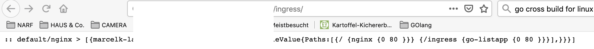

# Scope
## Task
* Setup and run Kubernetes Pod and use it to provide info about running Ingress Pods running in same cluster via Kubernetes API
* expose found info via website

## Prerequisites
* kubectl with accessible cluster (creds in ~/.kube/config)
* cluster-admin permissions to be able to create new roles
* setup github account to store source
* setup docker hub to store docker image
* docker env for OSX [Docker Desktop](https://hub.docker.com/editions/community/docker-ce-desktop-mac) .. macports is no option

## Ingress GO Piece (main.go)
* the ingress example is based on [KubernetesAPI](https://github.com/kubernetes/client-go/tree/master/examples/in-cluster-client-configuration)
* with some research and trial&error i found clientset.ExtensionsV1beta1().Ingresses("").List
* i simply lack the experience (coming from php arrays) to deal with this nasty result struct. Need feedback on how to pull out useful maps out of this garbled thing. Spew to the rescue to get at least something to show for :-)
* found this fine piece of code to get a webserver going and write some output. Needs wrapping into proper HTML syntax.
* This definetely needs improvement, but hey this is after 12h shared kubernetes/docker/go bootcamp. 
## Docker Piece (Dockerfile)
* checkout this ingress example
* use Dockerfile to build a docker image
`docker build -t ingress:tag .`
* find new image and note Image ID
`docker images`
* tag new image for upload
`docker tag <ID> escapechen/examples:ingress_NR`
* push to private repo, new TAG skips kubernetes images cache (and may consume more disk)
`docker push escapechen/examples:ingress_NR`
* adjust _deployment-ng_ File with new image name/tag and deploy ...
## Kubernetes Piece (kubernetes/)
* all files can be deployed using `kubectl apply -f <file.yaml>` 
* all kubernetes objects (deployments|services|roles|etc.) can be taken down using `kubectl delete <type> <name>`
* the _permission*_ Files deal with creating a dedicated service user which has only a very limited view on the cluster (basicall just view ingresses)
* _listService_ File introduces this extra layer between ingresses and application, to allow them to die/jump between nodes etc. Assuming there is some iptables NAT going on in the back. In our case, it points to our app on port 8000 and listens on port 80 to receive data from the ingress nginx.
* _ingress_ is the original ingress file for the initial LAB setup. I extended it to map /ingress to our new service. This way we also have a little bit more input for our Ingress Go Piece.
* _deployment-ng_ File is abstraction to pods. Basically sets up the environment, starts the pod(s) with various images, allows for replicas etc. In our case, it sets up a single pod using our dedicated user, pulls the image from the private github repo using provided credentials and fires up the _ingress GO piece_ which will continously listen on port 8000.
* _deployment-ng-viaWGET_ file for faster testing of new binary, since its a little tough to prototype things without local kube.
* _missingPiece_ is the secret for the docker registry, which can be created via:
`kubectl create secret docker-registry marcelk-regcred --docker-server=https://index.docker.io/v1/ --docker-username=escapechen --docker-password=NOBODY-KNOWS --docker-email=fancy@email.com`
## Troubleshooting
* Issue and no google results.. : 

`alfredprivat:ingress marcel$ go build main.go
 k8s.io/client-go/rest
../../../../../pkg/mod/k8s.io/client-go@v11.0.0+incompatible/rest/request.go:598:31: not enough arguments in call to watch.NewStreamWatcher
	have (*versioned.Decoder)
	want (watch.Decoder, watch.Reporter)`
* Solution, switch to bleeding edge:

`go get k8s.io/client-go@master`
